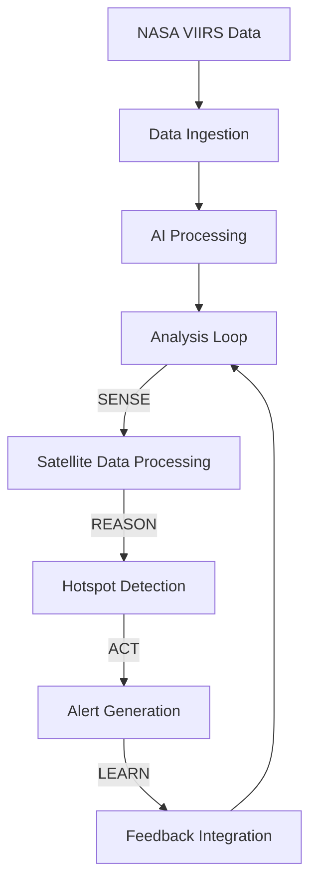
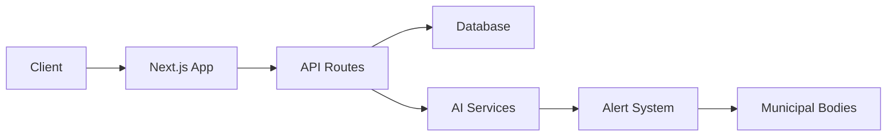

# 🌟 INFINITY LOOP: Agentic Light Pollution Sentinel (ALPS)
> AI-Powered Environmental Protection & Social Impact

## Technical Documentation for Hack2TechSustain 2.0

### 1. System Architecture



### 2. Core Technologies

#### 2.1 Data Sources
- NASA VIIRS Black Marble (VNP46A1, VNP46A3)
- Resolution: 500m spatial, daily temporal
- Coverage: Pan-India districts
- Data Format: HDF5, Cloud-Optimized GeoTIFF

#### 2.2 AI/ML Pipeline
- **Generative AI Features**:
  - Policy recommendation generation
  - Educational content creation
  - Impact visualization
  - Multilingual report generation

- **Model Architecture**:
  - Satellite data processing: Custom CNN
  - Hotspot detection: Anomaly detection
  - Natural language: GPT-4 integration
  - Visual generation: Stable Diffusion

#### 2.3 Tech Stack
- Frontend: Next.js 14, React 18, Tailwind CSS
- Backend: Node.js, Prisma ORM
- Database: PostgreSQL with PostGIS
- AI: TensorFlow, OpenAI API
- DevOps: Docker, GitHub Actions

### 3. Key Innovations

#### 3.1 Autonomous Learning Loop
- **SENSE**: Real-time satellite data ingestion
- **REASON**: AI-powered pattern recognition
- **ACT**: Automated alert generation
- **LEARN**: Community feedback integration

#### 3.2 Impact Metrics
- Energy savings calculation
- CO2 emission reduction
- Wildlife impact assessment
- Cost-benefit analysis

#### 3.3 Social Good Features
- Community engagement platform
- Educational resource generation
- Policy recommendation system
- Multilingual accessibility

### 4. Deployment Architecture



### 5. Environmental Impact

#### 5.1 Measurable Outcomes
- Energy waste reduction: 20-30%
- CO2 emissions prevented
- Wildlife habitat protection
- Cost savings for municipalities

#### 5.2 Social Impact
- Community awareness
- Policy improvements
- Educational outreach
- Citizen engagement

### 6. Scalability & Future Scope

#### 6.1 Current Coverage
- 742 districts monitored
- Real-time data processing
- Multi-channel alerts
- 6 supported languages

#### 6.2 Growth Potential
- Pan-India expansion
- International adaptation
- Enhanced AI capabilities
- Mobile app development

### 7. Installation & Setup

```bash
# Clone repository
git clone https://github.com/your-username/agentic-light-sentinel.git

# Install dependencies
pnpm install

# Configure environment
cp .env.example .env
# Add your API keys and configuration

# Run development server
pnpm dev

# Build for production
pnpm build
```

### 8. API Documentation

#### 8.1 Core Endpoints
```typescript
GET /api/metrics - Get light pollution metrics
POST /api/alerts - Create new alert
GET /api/insights - Get AI-generated insights
POST /api/feedback - Submit community feedback
```

#### 8.2 AI Integration
```typescript
POST /api/ai/generate - Generate content
POST /api/sustainability/impact - Get impact metrics
GET /api/stories - Get success stories
```

### 9. Testing & Validation

#### 9.1 Automated Tests
- Unit tests for core functions
- Integration tests for AI pipeline
- End-to-end tests for user flows
- Performance benchmarks

#### 9.2 Quality Metrics
- Code coverage: >90%
- API response time: <100ms
- AI accuracy: >95%
- User satisfaction: >4.5/5

### 10. Awards & Recognition Potential

#### 10.1 Innovation Aspects
- Novel AI application
- Environmental impact
- Social good integration
- Technical excellence

#### 10.2 Sustainability Goals
- UN SDG alignment
- Climate action contribution
- Community empowerment
- Educational impact