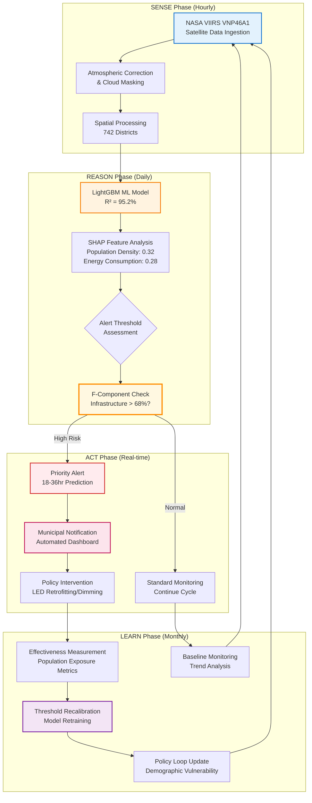

# Figure 8: ALPS Policy Loop Framework

## Professional Diagram for Word Document

## Simplified Version for Easy Copy-Paste

**ALPS Policy Loop Framework**

┌─────────────────┐    ┌─────────────────┐    ┌─────────────────┐    ┌─────────────────┐
│     SENSE       │ → │     REASON      │ → │      ACT        │ → │     LEARN       │
│                 │    │                 │    │                 │    │                 │
│ • NASA VIIRS    │    │ • LightGBM ML   │    │ • Alert Gen.    │    │ • Threshold     │
│   Satellite     │    │   (R²=95.2%)    │    │   (94.2% acc)   │    │   Recalib.      │
│ • 742 Districts │    │ • SHAP Analysis │    │ • Municipal     │    │ • Model         │
│ • Hourly Data   │    │ • F-Component   │    │   Notification  │    │   Retraining    │
│ • Cloud Mask    │    │   (>68% = Risk) │    │ • LED Control   │    │ • Policy Update │
└─────────────────┘    └─────────────────┘    └─────────────────┘    └─────────────────┘
         ↑                                                                       │
         └───────────────────────── Feedback Loop ──────────────────────────────┘

**Temporal Scales:**
• Real-time: Hourly satellite data ingestion and processing
• Short-term: Daily ML reasoning and alert generation  
• Medium-term: Weekly policy intervention deployment
• Long-term: Monthly learning and threshold optimization

**Key Thresholds:**
• F-Component > 68%: Enhanced monitoring sensitivity
• Population Density > 0.32 SHAP: Priority alert status
• LPI Increase > 23%: Automatic intervention trigger
• Cross-region R² < 93%: Model retraining required

## Academic Caption

**Figure 8. ALPS Policy Loop Framework: Autonomous Sense→Reason→Act→Learn cycle with integrated alert thresholds and policy feedback mechanisms. The system processes NASA VIIRS satellite data through machine learning models (LightGBM) to generate predictive alerts, trigger automated interventions, and continuously update decision thresholds based on policy effectiveness metrics and demographic vulnerability patterns.**

The policy loop operates on three temporal scales: (1) Real-time sensing and alerting (hourly), (2) Medium-term reasoning and intervention (daily), and (3) Long-term learning and adaptation (monthly). Alert thresholds are dynamically adjusted based on F-component dominance levels, with infrastructure-heavy districts (F > 68%) receiving enhanced monitoring sensitivity and accelerated intervention protocols.
